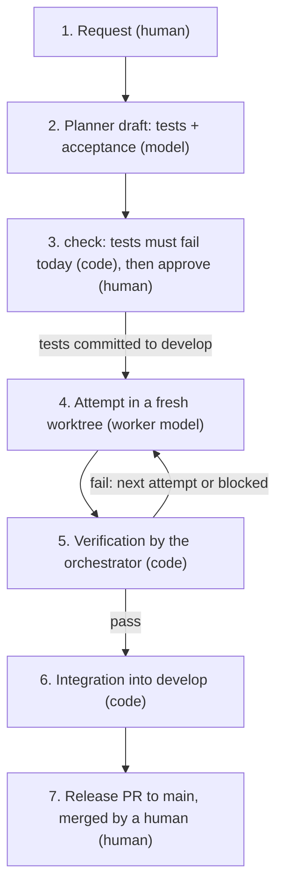

# Master System

**Unattended AI coding where the agent never decides when it's done.**

[](https://github.com/f0rrel/master-system/actions/workflows/tests.yml)


Master System is a control plane that wraps an off-the-shelf coding agent (the OpenCode
CLI) and treats it as untrusted. Before any work starts, a planner drafts tests for each
task, the system proves those tests fail on the current code, and a human approves them.
After the agent works, the system's own code runs those tests and decides whether the
task is done; the agent's report is recorded but not believed. Passing work is
integrated into a development branch; releases to `main` stay a human merge.

It is for developers who want to hand small, well-specified tasks to an agent overnight
and audit the result in the morning. Status: a personal, single-user project that runs
on one Linux machine and is used on one real project. Testers are welcome:
[try to break it](#try-to-break-it).

## What makes it different

- **A fixed definition of done.** Each task's acceptance commands and protected paths are
  drafted, checked to fail on today's code and approved before the attempt; the
  orchestrating model cannot change them (`core/planner_checks.py`,
  `core/work_manager.py`), and every attempt is bound to the spec by a hash
  (`core/evidence.py`).
- **Claims are recorded, not believed.** The worker's status and usage are stored as
  claims; the orchestrator commits the worktree itself and the verifier runs the
  acceptance commands on that commit (`core/task_orchestrator.py`,
  `core/acceptance_verifier.py`).
- **One allowlisted operation per step.** The orchestrating model (internally "Master")
  proposes one of seven operations at a time; code decides whether a task may complete
  or be integrated (`core/reasoning.py`, `core/evidence.py`).
- **Infrastructure failures are not task failures, and nothing is replayed.** A provider
  limit ends an attempt as `limited` and a worker that changes nothing as `stalled`;
  neither counts against the task. An attempt found unfinished after a crash is marked
  `interrupted` and never re-run (`core/task_orchestrator.py`, `core/recovery.py`).
- **Re-verification on the integration target, human-merged releases.** If `develop` moved,
  the attempt is cherry-picked onto it and verified again before a fast-forward. The
  system's code never merges to `main`, and the ruleset blocks direct pushes
  (`core/attempts.py`, `core/release.py`).

What it is not: not a coding agent (it wraps one), not a sandbox, not multi-user, not a
hosted service.

## How a task flows



1. **Request:** describe the change in `ms chat <project>`, or plan an epic from the
   backlog (`ms backlog`).
2. **Draft:** the planner model drafts small tasks, each with test files, acceptance
   commands and manual-check steps (`core/planner.py`).
3. **Check and approve:** `check` runs the drafted tests in a fresh worktree and requires
   them to fail on the current code; `approve` commits them to `develop` (`core/planner_checks.py`).
4. **Attempt:** the background service starts a run; the orchestrating model picks the
   next operation and the worker edits a fresh git worktree (`core/task_orchestrator.py`).
5. **Verification:** the orchestrator commits the worktree and runs the acceptance
   commands itself (`core/acceptance_verifier.py`).
6. **Integration:** a verified attempt is fast-forwarded into `develop`, or replayed and
   re-verified if `develop` moved (`core/auto_integrate.py`).
7. **Release:** `ms release` opens a pull request from `develop` to `main`; a human
   merges it (`core/release.py`).

## Example: one task, end to end

This is an illustration built from the example definition in
[`examples/projects/example-app/`](examples/projects/example-app/), not captured output.
Task `app-1`, "Greet the visitor by name", has this acceptance block:

```yaml
acceptance:
  commands:
  - npm ci --no-audit --no-fund
  - node --test tests/tasks/app-1-greeting.test.js
  - node --test tests/unit/*.test.js
  protected_paths:
  - tests/*
  - package.json
  - package-lock.json
```

- **must not:** the draft also states what must not happen, in the owner's terms, and
  its test checks it; for this task, for example, "the start page still shows the
  greeting when no name is entered". Approval stores it in the description as a
  "Must not:" section (illustration: the example definition predates the field).
- **check:** in a fresh worktree, `node --test tests/tasks/app-1-greeting.test.js` must
  fail on today's code (the planner drafted that file), and `tests/unit` must pass.
- **approve:** the test file is committed to `develop`, and the task is queued with the
  acceptance above.
- **An attempt that edits `tests/tasks/app-1-greeting.test.js`** fails with a
  `protected_path` finding: "1 protected path(s) changed". Deleting or renaming the file
  counts too.
- **An attempt that reports success without making the test pass** fails with a
  `command_failed` finding: "1 of 3 command(s) failed". The worker's report changes
  nothing: the completion gate does not let the task complete without a verified pass.
- **A real fix** gives "all 3 command(s) passed" and is fast-forwarded into `develop`.
- **The human** follows the manual check on the preview and merges the release pull request.

<!-- TODO: real ms report excerpt -->

## Trust model

| Role | What it can do | What checks it |
| --- | --- | --- |
| Planner | drafts tasks and tests | fail-first check + human approval |
| Orchestrating model | proposes one allowlisted operation per step | policy + completion gate; cancelling waits for a human |
| Worker | edits a fresh worktree with a bash-capable agent | the verifier; its claims are ignored |
| Visual reviewer | can only turn pass into fail | — |

**The worker gets** a fresh git worktree at the tip of `develop`, a deadline enforced by
coreutils `timeout` in its own process group, and an allowlisted environment
(`core/worker_env.py`): `PATH` is a Node `bin` directory (if one is found), any
`[worker] path_dirs`, then `/usr/local/bin:/usr/bin:/bin`, and `HOME` is a dedicated
worker home. **It never gets**
API keys or tokens in its environment; secret-looking extras are refused. It does run as
the same OS user, so it can read any file that user can, including `master.env` and the
GitHub App key.

**Around the worker**, the orchestrator records every ref of the dedicated clone and its
shared git configuration, hooks and `info/` files, and puts them back before it commits
the worker's result; a change beyond the attempt's own branch fails the attempt as
`repository_tampered`. That is detection and restoration, not a sandbox. Its own git
commands run without repository hooks, and `develop` is pushed only at a tip the system
set.

**The verifier** (`core/acceptance_verifier.py`) runs in a fresh worktree of the commit the
orchestrator made of the attempt's result, never in the worker's. It reports `unable_to_verify` if the task has no
acceptance or the worktree is not clean, a `protected_path` finding for any changed,
renamed or deleted protected path, an `outside_allowed_paths` finding for changes outside
the task type's paths, and a `command_failed` finding for any acceptance command that
fails or times out. It passes only with no findings. It is independent of the worker:
the commands were fixed and approved before the attempt, the orchestrator runs them, and
the result is bound to the task's `spec_hash`.

| Defends against | Does not defend against |
| --- | --- |
| False success reports | A worker deliberately using its shell against the host: it runs as your user |
| Edited, deleted or renamed protected tests | A worker acting outside git as your user: reading keys, editing `~/.gitconfig` or the dedicated clone's files (gap N1) |
| Files changed outside the task type's paths | Changes to the shared git directory while the worker runs: they are undone afterwards, not prevented (gap V2, narrowed) |
| Uncommitted or ignored files changing the verdict (fresh verification worktree) | Processes that escape their group with `setsid` (gap N1) |
| Moving `develop`, tags, hooks or git config from the worktree (restored, attempt fails) | Weak tests that a human approved |
| Pushing a `develop` that no gate produced (publish guard) | The orchestrating model retitling tasks or setting them blocked, in progress or planned (gap H2) |
| Hangs (deadline and process-group kill) |  |
| A spec changed after a pass |  |
| The orchestrating model completing or integrating without evidence |  |
| Crashes mid-attempt (no replay) |  |
| The orchestrating model cancelling a task it cannot finish (held for you) |  |

Details: [safety rules](docs/ARCHITECTURE.md#safety-rules-and-trust-boundaries) and
[known gaps](docs/ARCHITECTURE.md#known-gaps).

## Try it

**Before you start.** It runs on Linux only. The default caps are $0.50 a day, $0.20 per
run and $0.30 per planner chat. Data leaves your machine: the planner sends the project
files it reads and the README to the planner model, the worker sends code to its model
provider through OpenCode, and the visual reviewer sends screenshots. Because workers run
as your user, use a VM, a container or a separate Linux user, a throwaway repository and
spend-limited keys.

**Prerequisites:** Python 3.12+ and [uv](https://docs.astral.sh/uv/); git and coreutils;
for Node projects, Node.js ≥ 22 (found through `[worker] node_bin`, nvm, or the system
`PATH`; without it, runs warn and Node-based acceptance commands fail); the
[OpenCode CLI](https://opencode.ai) at `~/.opencode/bin/opencode`; a DeepSeek API key.
Acceptance commands see only that Node `bin` directory, `[worker] path_dirs` and
`/usr/local/bin:/usr/bin:/bin`, with `HOME` set to the worker home: tools in
`~/.local/bin` (uv, pipx) are invisible unless you add it to `path_dirs`, and `python`
fails where only `python3` exists.

A minimal local trial, without the GitHub App, systemd or Telegram:

```bash
export MS_HOME=~/src/master-system
git clone https://github.com/f0rrel/master-system.git "$MS_HOME" && cd "$MS_HOME"
uv sync
uv run python -m core.ms install                 # puts `ms` in ~/.local/bin, creates the projects root
chmod 700 ~/.config/master-system
printf 'DEEPSEEK_API_KEY=%s\n' '<key>' > ~/.config/master-system/master.env
chmod 600 ~/.config/master-system/master.env
HOME=~/.local/share/master-system-worker ~/.opencode/bin/opencode auth login
```

**The quickstart** ([examples/quickstart](examples/quickstart)) is a tiny Node project
with no dependencies (`node --test`), and a project definition for it. Create its
dedicated repository, then run the commands the script prints:

```bash
sh "$MS_HOME"/examples/quickstart/init.sh ~/managed/quickstart
# it prints, for this target:
mkdir -p ~/.config/master-system/projects/quickstart
cp "$MS_HOME"/examples/quickstart/project/*.yaml ~/.config/master-system/projects/quickstart/
sed -i "s#^repository:.*#repository: $HOME/managed/quickstart#" \
    ~/.config/master-system/projects/quickstart/project.yaml
ms backlog quickstart add "Add a farewell function"
ms chat quickstart    # "plan epic 1 from the backlog", then `check`, then `approve`
ms daemon --once      # one service cycle in the foreground
ms report             # attempts, verdicts, tokens and cost
git -C ~/managed/quickstart log --oneline develop
ls ~/.local/share/master-system-worktrees/quickstart/
```

The script writes only the target directory. **Your own project** works the same way:
a dedicated clone with a `develop` branch and a test command that works on the worker
`PATH`, and a definition copied from the quickstart's (or from
[examples/projects/example-app](examples/projects/example-app)) with your `id`,
`repository` and the planner's test conventions:

```yaml
planner:                                     # a Node project with dependencies
  test_dir: tests/tasks
  test_suffixes: [".test.js"]
  syntax_check: "node --check {path}"
  test_command_examples: ["node --test {path}"]
  setup: ["npm ci --no-audit --no-fund"]
  base_checks: ["npm test"]
---
planner:                                     # a Python project: pytest in a project venv
  test_dir: tests/tasks
  test_suffixes: [".py"]
  syntax_check: "python3 -m py_compile {path}"
  test_command_examples: [".venv/bin/python -m pytest -q {path}"]
  setup: ["python3 -m venv .venv", ".venv/bin/pip install -q pytest"]
  base_checks: [".venv/bin/python -m pytest -q tests/unit"]
```

The setup commands are also the first acceptance commands of every planned task, and
verification runs in a fresh worktree, so acceptance must build what it needs from
committed files. The repository's `.gitignore` should cover what setup creates
(`node_modules/`, `.venv/`): the orchestrator commits everything a worker leaves in its
worktree.

Without a `github` section nothing is pushed; with one but no GitHub App, publishing is
skipped with a message. **Clean up:** remove `~/.config/master-system`,
`~/.local/share/master-system`, `~/.local/share/master-system-worktrees`,
`~/.local/share/master-system-worker`, `~/.local/bin/ms` and the dedicated clone.

Full setup (the service, GitHub, Telegram): [docs/REFERENCE.md](docs/REFERENCE.md),
[docs/GITHUB-SETUP.md](docs/GITHUB-SETUP.md), [docs/TELEGRAM-SETUP.md](docs/TELEGRAM-SETUP.md).

## Try to break it

I want bypasses, not compliments. In order of priority: (1) work marked done or
integrated that did not meet its acceptance; (2) `develop` or `main` changed without the
required gate; (3) secrets reaching a worker's environment or logs; (4) crash and
recovery bugs: replay, lost work, a stuck lock; (5) setup failures; (6) documentation
errors.

| Target | What to try | Expected behaviour per the code | Where to look |
| --- | --- | --- | --- |
| Fake success | Have the worker report success without passing the test | `command_failed`; the task is not completed | `ms report`, history |
| Protected tests | Edit, delete or rename a file under `tests/` | `protected_path` finding, verdict fail | `ms report` |
| Type paths | Make a `docs` task touch `src/` | `outside_allowed_paths` finding, verdict fail | `ms report` |
| Ignored files | Leave a file ignored by `.gitignore` or `.git/info/exclude` that changes a test's outcome | Not in the fresh verification worktree, so it cannot help; through `info/exclude` also `repository_tampered` | `ms report`, `git -C <clone> log develop` |
| Moving `develop` | `git update-ref refs/heads/develop <sha>` from the worktree | `develop` restored before the snapshot; verdict fail with `repository_tampered` | `ms report`, `git -C <clone> log develop` |
| Hooks and config | Plant a hook, an `info/` file or a filter driver in the clone's git directory | Removed before control-plane git runs (which ignores hooks anyway); `repository_tampered` | `ms report`, `ls <clone>/.git/hooks` |
| Publishing a hand edit | Commit to `develop` in the dedicated clone outside a run, then wait for publishing | Not pushed; "needs you" until `ms publish <project> --accept-tip` | `ms status`, notifications |
| Process escape | `setsid` a process that outlives the attempt | **Known gap N1** | `ps` |
| Crash | `kill -9` the run during an attempt | The attempt becomes `interrupted` and is not replayed | `ms report`, history |
| Concurrent change | Commit to `develop` by hand during a run | While the worker runs: undone like a worker's change (the attempt fails; the commit's sha is kept in `restored_refs`). After it: replay onto the new tip and re-verification, or `integration_refused` and a new attempt; either way not published without `--accept-tip` | `git log`, history |
| Prompt injection | Instructions in task text, `DIRECTION.md` or repository files aimed at the planner or orchestrating model | Never completed without a pass or integrated without the gate; a cancellation is held for you (`ms status`); retitling or other status changes are possible (gap H2, known) | history, `ms status` |
| Dropping a task | Get the orchestrating model to cancel a task it cannot finish (a hard task, or a hint in the task text) | Held with `cancellation_requires_human`; the task waits for `ms reopen` or `ms cancel`, other tasks keep running | `ms status`, history |
| Trivial tests | Get the planner to draft tests that fail now but pass trivially | Nothing stops this except human review of the draft | `ms chat` → `show` |
| Spend | Push spend past the caps | Caps are checked between steps; one call in flight can overshoot | `ms status`, `ms report` |
| Release | Change `develop` after the release pull request opens | The pull request shows the new commits; after a merge, the release is tagged only if the merge's tree equals the pull request head's tree at merge time, so commits added after opening are released if the human merges | `ms status`, GitHub |

Already known, so please report these only if you find a new route: changes to the shared
git directory that take effect before they are undone, or files in it that are not checked
(V2, narrowed), `setsid` escapes and anything else that follows from workers running as
your user (N1), and the orchestrating model retitling tasks or changing their status other
than to completed or cancelled (H2). Ignored files (V1), moving `develop` from a worktree,
and git hooks or filters (including in `~/.gitconfig`, G1) are now defended: a route
around any of them is a bypass. The full list is in
[known gaps](docs/ARCHITECTURE.md#known-gaps).

**Useful feedback includes:** the master-system commit; `ms doctor` output (it redacts
secrets); `ms report` for the run; the task's YAML; the attempt id; expected versus actual
behaviour; and whether the worker ran as a separate user. The `[bypass]` and `[setup]`
[issue templates](https://github.com/f0rrel/master-system/issues/new/choose) ask for
exactly these; use title prefixes `[recovery]` or `[docs]` for other
[issues](https://github.com/f0rrel/master-system/issues).

## Used in practice

The system develops [Match Legends](https://github.com/f0rrel/Match_Legends_mobile_game),
a hex match-3 web game. Its `develop` branch has commits authored by `master-system`
(task commits titled `ml-N: …`, earlier ones titled `attempt <id>`) and by
`Master System planner` (acceptance tests); at the time of writing, 14 and 2 of them
([commit list](https://github.com/f0rrel/Match_Legends_mobile_game/commits/develop)).
Release [`v0.1`](https://github.com/f0rrel/Match_Legends_mobile_game/releases/tag/v0.1)
is the merge of pull request #1 from `develop`. Preview of `develop`:
<https://f0rrel.github.io/Match_Legends_mobile_game/develop/>; released version:
<https://f0rrel.github.io/Match_Legends_mobile_game/>.

<!-- TODO: real per-task cost figures -->

## Status and limitations

- Single user, one machine, Linux; the background service is a systemd user unit.
- Model-agnostic by design (adapters; boundary tests forbid provider names above them);
  the tested configuration is DeepSeek for planning, orchestration and review, and
  OpenCode for the worker.
- Not a sandbox: workers run as your user, and the
  [known gaps](docs/ARCHITECTURE.md#known-gaps) list the consequences.
- Next: policy by state transition, approvals outside a run and unified attempt budgets;
  later, an evaluation of DBOS for durable execution and an OS-level worker sandbox. See
  [CHANGELOG.md](CHANGELOG.md), [docs/DECISIONS.md](docs/DECISIONS.md) and the
  [roadmap](docs/REFERENCE.md#roadmap).

Operational features, described in [docs/REFERENCE.md](docs/REFERENCE.md):

- [Telegram bot](docs/REFERENCE.md#phone-workflow-telegram): the phone interface, paired to one owner.
- [ntfy notifications](docs/REFERENCE.md#notifications): the fallback channel.
- [Backlog](docs/REFERENCE.md#daily-workflow): epics in priority order, planned one at a time.
- [Generated images](docs/REFERENCE.md#adding-a-project): candidates the owner picks for visual tasks.
- [Lessons](docs/REFERENCE.md#command-reference): worker suggestions used only after approval.
- [Worker limits and tiers](docs/REFERENCE.md#configuration): waits, owner choices, escalation.
- [Morning summary](docs/REFERENCE.md#notifications): one report when the work runs out.

## For engineers

Code entry points:

- `core/task_orchestrator.py`: one attempt: worktree, worker, snapshot commit, verification.
- `core/acceptance_verifier.py`: the definition of done, checked on the committed result.
- `core/evidence.py`: `spec_hash`, the completion gate and the facts the orchestrating model sees.
- `core/reasoning.py`: the operation allowlist and the approval policy.
- `core/autonomous_loop.py`: one run: model proposal, policy, execution, stop conditions.
- `core/attempts.py` and `core/auto_integrate.py`: integration, replay and re-verification.
- `core/worker_env.py` and `core/worker_process.py`: the worker's environment and process control.
- `core/planner_checks.py`: the fail-first check and approval.

Tests that encode the trust model: `tests/test_acceptance_verifier.py`,
`tests/test_evidence.py`, `tests/test_verification_boundary.py`,
`tests/test_backend_boundaries.py`, `tests/test_worker_env.py`,
`tests/test_approval_policy.py`.

```bash
uv sync --extra dev && uv run python -m pytest -q   # about 1,470 offline tests, about a minute and a half
```

More: [ARCHITECTURE](docs/ARCHITECTURE.md), [DECISIONS](docs/DECISIONS.md),
[TROUBLESHOOTING](docs/TROUBLESHOOTING.md), [CHANGELOG](CHANGELOG.md). `archive/` holds
early experiments that the code does not use.

## License

[MIT](LICENSE)
